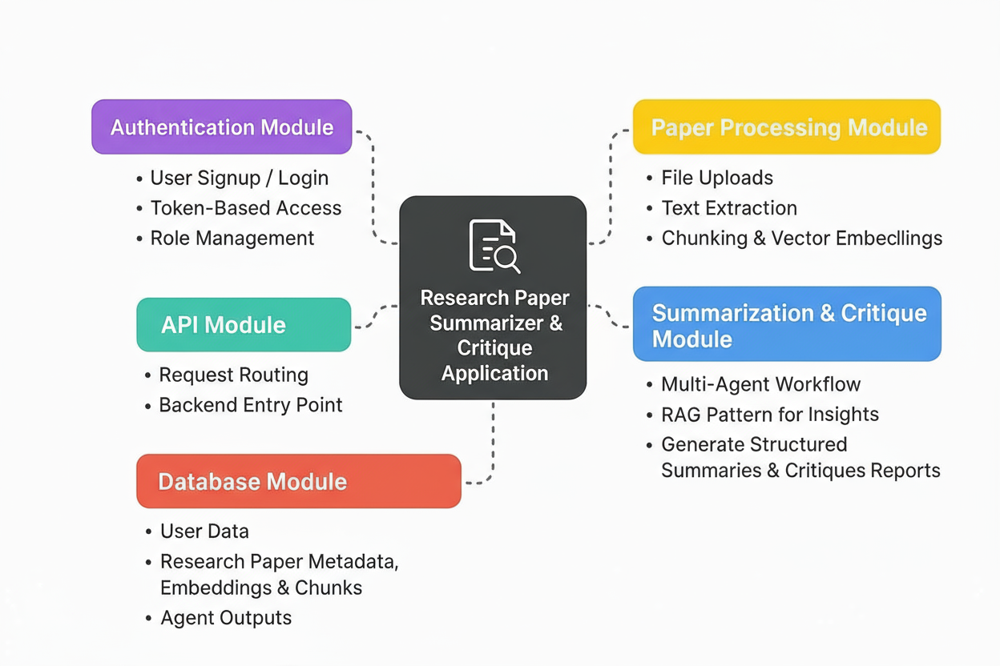
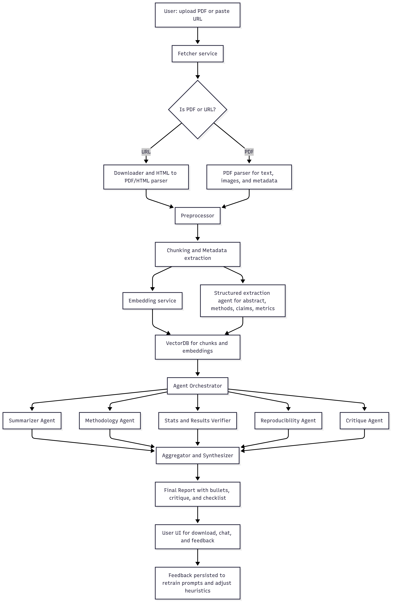

<div align="center">

<h3 align="center">Research Paper Summarizer & Critique Application</h3>

<div align="center">
An AI-powered app designed to help users summarize, analyze, and critique academic research papers. The system provides paper upload, automatic extraction, agentic analysis, and query processing to generate insights and structured reports.
</div>
<br />
<div>


</div>

</div>

---

## Module Overview

The application is designed with a robust modular architecture where each module handles a specific responsibility. The following diagram summarizes all key modules and their roles:



- **Authentication Module**: Handles user signup, login, JWT token-based access for secure entry.
- **API Module**: Acts as the backend entry point for routing requests between frontend and backend services.
- **Database Module**: Stores user data, research paper metadata, embeddings, chunks, and analysis outputs.
- **Paper Processing Module**: Manages file uploads, text extraction from documents, chunking, and vector embeddings.
- **Summarization & Critique Module**: Implements agentic workflow that analyze research papers, generate insights, and produce structured summaries and critiques.

---

## System Flow

The following flow diagram explains the step-by-step process from paper submission to generation of summaries, critiques, and feedback integration:



- Users can upload a PDF of research paper.
- The system fetches and preprocesses the content using specialized parsers.
- The content is chunked, metadata is extracted, and vector embeddings are created.
- LLM Rag chain is invoked that analyze different aspects of the paper.
- Outputs are synthesized and converted into structured reports and bullet lists.
- Summaries generated by user are sotred in database and user can access the generated summaries for reference from a dashboard provided in UI.

---

## Tech Stack

- **FastAPI**
- **Python**
- **Pinecone VectorDB (for embeddings and retrieval)**
- **MongoDB (for user data and metadata storage)**
- **React**
- **TypeScript**
- **Tailwind CSS v4**

---

## Features

- **Upload & Extract Papers**: Accepts PDF, extracts text, images, and metadata automatically.
- **Chunking & Embeddings**: Divides text into logical sections and creates vector embeddings for efficient retrieval.
- **Automated Summarization**: Uses LLM RAG to generate context-aware, structured summaries and critiques.
- **Query Submission**: Users can ask questions about the paper and get AI-powered answers based on vector retrieval.
- **Secure Authentication**: Supports JWT (JSON Web Token)user authentication, session management, and access control.

---

# Full Stack Application Setup Guide

This project consists of a **React frontend** and a **FastAPI backend**.  
Follow the steps below to set up, install dependencies, and run both parts of the application.

---

## Backend (FastAPI)

### Navigate to the backend directory

```bash
cd backend
```

### Installation and Development

Since backend is setup using uv simply run below command, it will install dependencies and run on uvicorn server automatically.

```bash
uv run uvicorn server.main:app --reload --host localhost --port 8000
```

Your server will be available at `http://localhost:8000`.

## Frontend (React)

### Navigate to the frontend directory

```bash
cd frontend
```

### Installation

Install the frontend dependencies:

For the React frontend

```bash
npm install
```

### Development

Start the development server with HMR:

```bash
npm run dev
```

Your application will be available at `http://localhost:5173`.
